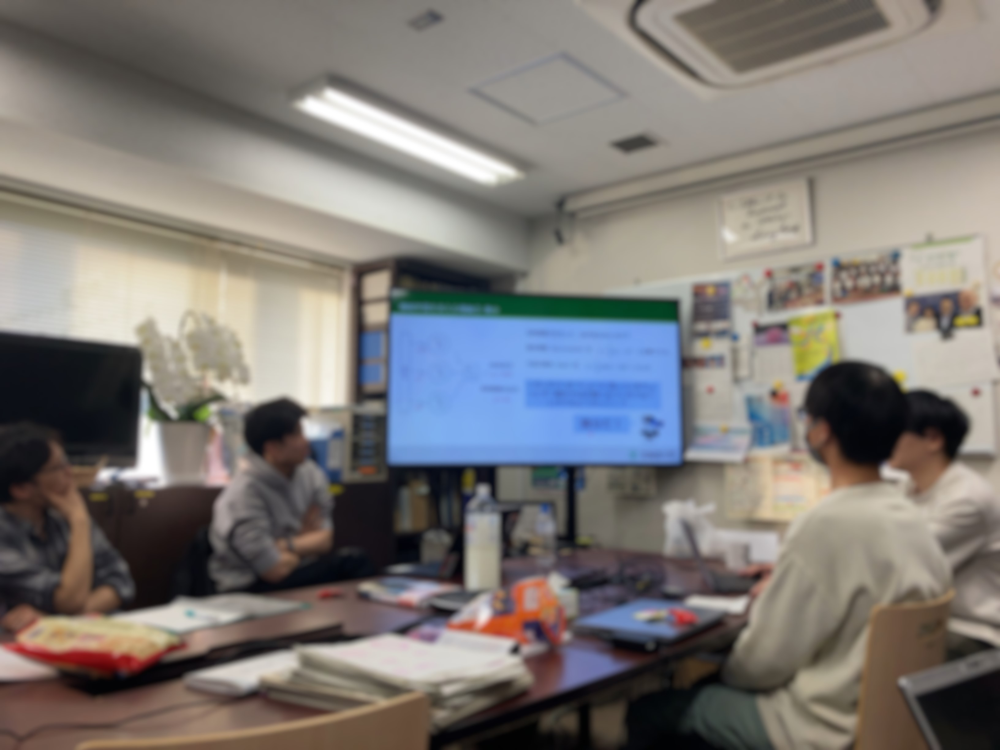

先日、「**ニューラルネットワークの基礎**」と題した勉強会を開催し、多くの方にご参加いただきました。誠にありがとうございます。

本勉強会では、ニューラルネットワークの根幹をなす理論から、画像認識などで広く活用されるCNNに至るまで、以下の内容について重点的に解説と議論を行いました。

---
## ニューラルネットワークの基礎

### ニューラルネットワークの概要

- ニューラルネットワークとは
- 活性化関数（シグモイド関数、ReLU関数など）の役割

### フォワードプロパゲーション（順伝播）

- 入力データがネットワークをどのように伝播し、出力が得られるかの計算プロセス

### 損失関数

- モデルの予測精度を測る指標（平均二乗誤差）
- なぜ損失関数が重要なのか

### バックプロパゲーション（誤差逆伝播法）

- 損失関数を最小化するための勾配計算アルゴリズム
- 連鎖律（Chain Rule）を用いた、各層の重みとバイアスに対する勾配の効率的な計算方法
- 勾配降下法（Gradient Descent）と、それを用いたパラメータ更新のメカニズム
- バックプロパゲーションがニューラルネットワークの学習において不可欠である理由

---

## 畳み込みニューラルネットワーク (CNN) の基礎

### CNNの概要

- 特に画像認識などのタスクで優れた性能を発揮

### 畳み込み層 (Convolutional Layer)

- フィルター（カーネル）の概念と、それを用いた特徴抽出の仕組み
- ストライドとパディングの役割、およびそれらが出力サイズに与える影響
- 入力データから局所的な特徴を抽出する能力

### プーリング層 (Pooling Layer)

- Maxプーリングなどの代表的なプーリング処理

### CNNの典型的構造

- 畳み込み層とプーリング層の組み合わせ、最後に全結合層

---

特に**誤差逆伝搬法（BackpropagationBackpropagation）**と**CNNの畳み込み演算**に関しては、図や数式も交えながら、その計算ステップや各パラメータがどのように更新されていくのかを丁寧に解説いたしました。

参加者の方々からは、**モデルの学習過程**や**誤差逆伝搬法の計算手法**に関するご質問など、実践的な内容に踏み込んだ質疑応答が活発に行われ、非常に有意義な時間となりました。

---

今後も、**機械学習**や**AIの医療応用**に関連するテーマで勉強会を企画してまいります。ご興味をお持ちの方は、ぜひ次回のご参加をご検討ください。


  
  
